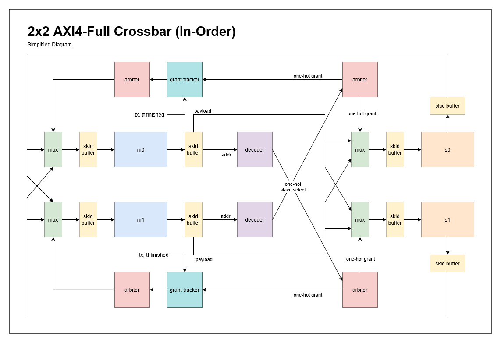

# NxM AXI4-Crossbar
## Introduction
This project implements an in-order NxM AXI4-Crossbar system paired with a DMA engine and simple 32x1024 SRAM block in SystemVerilog using **Verilator for linting/simulation, cocotb and cocotbext-axi for verification, and Surfer for waveform viewing**.

## Features

* **Parameterizability**: Configurable with NxM Masters/Slaves and supports full address/data/queue customizability.
* **In-Order Execution**: Transactions are completed in the order they were requested.
* **Skid Buffer Pipelining**: Pipelining done with skid buffers to eliminate handshake signal latency.
* **Round-Robin Arbitration**: Multiple device arbitration is done with round-robin granting.

#### Critical Path: *TBD*.

#### Max Clock Speed: *TBD*.

## Specifications

### Parameters
* `NUM_MASTERS`: Number of AXI master ports (default: `2`).
* `NUM_SLAVES`: Number of AXI slave ports (default: `2`).
* `ADDR_WIDTH`: Address bus width (default: `32`).
* `DATA_WIDTH`: Data bus width (default: `32`).
* `ID_WIDTH`: Transaction ID width (default: `4`).
* `MAX_OUTSTANDING_TX`: Maximum number of outstanding transactions supported by the grant trackers (default: `8`).

### Port List
The top-level module [axi_crossbar.sv](file:///c:/Users/dylan/Documents/vscode/axi-crossbar/source/axi_crossbar.sv) has the following ports:
* `clk`: System clock.
* `n_rst`: Active-low asynchronous reset.
* `m`: Array of AXI interfaces configured as slaves (`axi_if.slave`), representing connections to masters.
* `s`: Array of AXI interfaces configured as masters (`axi_if.master`), representing connections to slaves.

### Running Simulations
To run a simulation for a specific module (e.g., the address decoder or the mux), run:
```bash
# Run axi_addr_decoder.sv module verification
make axi_addr_decoder_sim

# Run axi_mux.sv module verification
make axi_mux_sim
```

## Implementation details


You can view the diagram on drawio [here](https://drive.google.com/file/d/1dBV1LzKK90WF5i-RrpE6lwYEfy03LkbD/view?usp=sharing).

## Directory Structure
* `source/` — Core SystemVerilog RTL modules.
* `testbench/` — cocotb Python simulation testbenches.
* `tb_wrappers/` — Verilog wrapper modules for testbenches.
* `scripts/` — Helper scripts for test reporting and waveform styling.
* `waves/` — Waveforms and Surfer configuration files.
